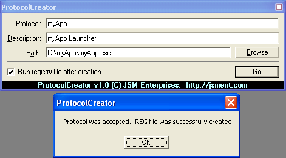



## ProtocolCreator

### Description

Creates a .REG file which, when ran, will allow your App to be spawned whenever "myApp://blahblahblah" is entered into a run dialog or web browser, etc... just like when you enter "http://blahblahblah" into the run dialog. A BAS module is included which makes it real easy to add this functionality to your app, just one line of code on your part. You can set a flag to allow only protocols that are not common, for example, entering 'http' with the flag set to false will throw an error, which can be caught and displayed in a message box or any other control. Give it a try and PLEASE vote for me if you find this code useful! Email me with questions and/or comments!
 
### More Info
 
You need to know how to call a function, thats all!

             |
---                |---
**Submitted On**   |2002-06-26 16:03:06
**By**             |[Josh McCullough](https://github.com/Planet-Source-Code/PSCIndex/blob/master/ByAuthor/josh-mccullough.md)
**Level**          |Intermediate
**User Rating**    |3.8 (23 globes from 6 users)
**Compatibility**  |VB 6\.0
**Category**       |[Registry](https://github.com/Planet-Source-Code/PSCIndex/blob/master/ByCategory/registry__1-36.md)
**World**          |[Visual Basic](https://github.com/Planet-Source-Code/PSCIndex/blob/master/ByWorld/visual-basic.md)
**Archive File**   |[ProtocolCr991026262002\.zip](https://github.com/Planet-Source-Code/josh-mccullough-protocolcreator__1-36294/archive/master.zip)

